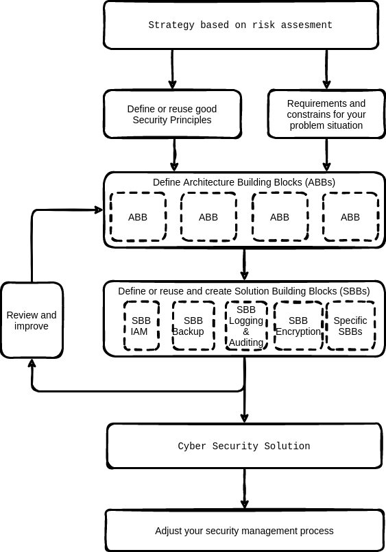

% TAGS [PREVENTION] [BUSINESS]

# How to create a security architecture?

## Problem

To prevent security disasters from the start developing a security architecture from the start is a must do. However creating a security architecture is not simple by default.

## Solution 

Creating a security architecture for a specific product does not have to be complex. Too often security architectures have drifted from the essential goal. That is to think in advantage about measurements that should be taken to mitigate common security vulnerabilities.  Too often this results in long documents that are seldom read and have become useless for engineers.

:::{tip}
A security architecture helps in the continuous process of optimizing and controlling your security risks.
:::

Creating security a security or privacy solution architecture consists minimal of the following steps:

* Gather security and privacy principles and requirements;  
* Use a good reference architecture or architectures. So use external and internal reference architectures if available. This to make sure the security architecture that must be created has a very clear focus.  
* Use a risk based approach. A discussion with responsible management on risks and possible costs for risk mitigation it is useless to proceed. To use a risk based approach creating a thread model is vital.  
* Work principle based.   
* Determine important constraints that apply to your architecture or design. There are always constraints, e.g. time, budget, maintenance costs, subject matter experts available etc.  
* Derive the architecture building blocks from your architecture or design. Architecture building blocks help you to scope your solution. Using architecture building blocks gives a clear view on (new) integration aspects and where completely new solutions fit in the total IT landscape.  
* Select (or create, or buy) the new Solution Building Blocks. Prerequisite is of course that the functionality and technical constraints must be clear. Often prerequisites are derived from the previous design step. Speedup selection and evaluation of FOSS Security solutions by making use of [this free guide](https://nocomplexity.com/documents/securitysolutions/intro.html).

Creating a good security architecture, including a threat model and gathering and discussion requirements and constraints is an iterative process. So avoid creating a blueprint architecture in splendid isolation without discussion with all stakeholders. This has never worked.

Creating security a security or privacy solution architecture consists of the following high level steps:

* Dive in the business strategy and organization. Perform a simple risk assessment.

*   Gather security principles and requirements that are relevant for your context.

*   Determine important constraints that apply to your security architecture. There are always constraints, e.g. time, budget, subject matter experts available etc.

*    Derive the architecture building blocks from your architecture or design. Architecture building blocks help you to scope your solution. Using architecture building blocks gives a clear view on (new) integration aspects and where completely new solutions fit in the total IT landscape.

*  Define or reuse the Solution Building Blocks needed to create the design. Prerequisite is that the functionality as specified in the Architecture Building Blocks must be clear.

*  Review and improve your solution. Use internal stakeholders, but also get review input from one or more external independent reviewers. An external reviewer has **no** internal interests but is solely focussed on improving your security architecture. If you need help to find an [external reviewer, just ask advice!](https://nocomplexity.com/securityreview/).

