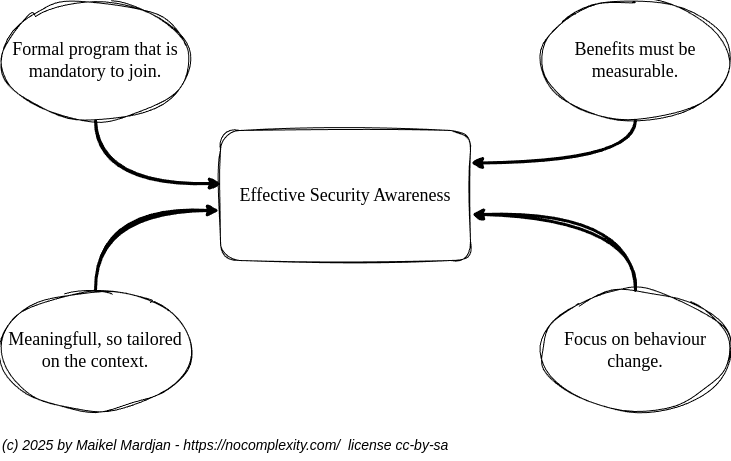

% TAGS [PREVENTION] [BUSINESS]

# Security awareness

## Problem

How to implement an effective security awareness program?

## Solution

Effective security awareness is achieved through an ongoing process of learning that is meaningful to recipients, and delivers measurable benefits to the organisation from lasting behavioural change.

Four key elements for an effective security awareness are:
1. Formal programme structure: a security awareness programme is most likely to succeed if it is structured as a formal programme of work, as opposed to a series of ad hoc activities, because it will have a sustained pace of delivery that applies a consistent driving force on staff behaviour. If that driving force is removed, then staff are likely to revert to earlier security-negative behaviours.

2. Meaningful messages: the key messages, tone and approach of the programme must be relevant to the audience and consistent with their values and goals: if security is perceived as a hindrance to their own personal activities, then the message will carry little meaning.

3. Measurable benefits: an effective security awareness programme should deliver a security-positive change in behaviour. That change should in turn result in a reduction in one or more of the following aspects:

* more damage arising from security-related incidents
* cost of security management
* the organisation’s overall level of risk.
All of these reductions should be quantifiable and in most cases measurable as a financial benefit to the organisation.

4. Lasting change in behaviour: the purpose of an effective security awareness programme should be to create and maintain a security-positive change in the behaviour of the recipients. If the change is not maintained, and staff revert to their previous behaviours, then the programme has not been effective.

