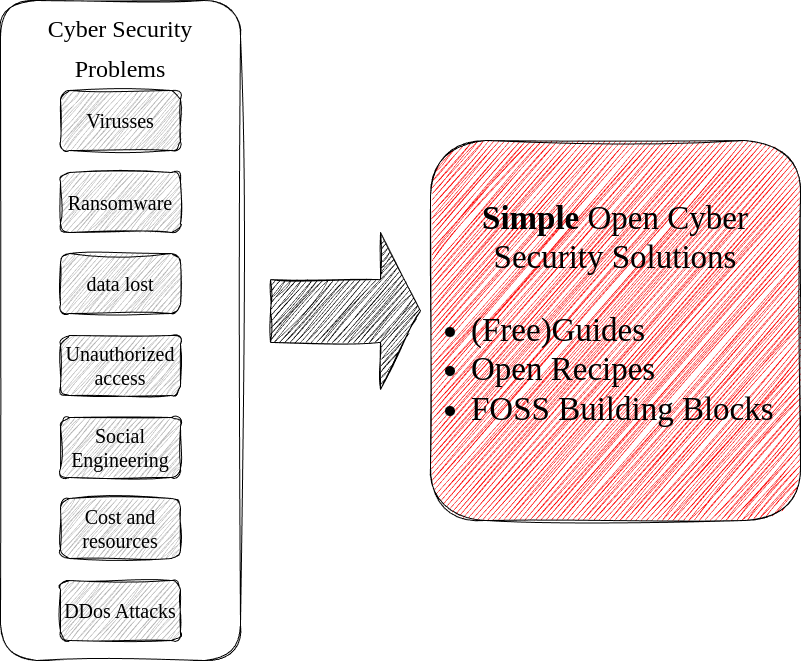

# Introduction

There are many myths about security, and how difficult it is. And the worse is: Some are true.

:::{danger} 
Cyber security is a complex domain. Managing and mitigating risks is not easy.
:::

There is no perfect solution. Never. But there are simple solutions for  **common** cyber security challenges that do work. 

The best cyber security solutions are open solutions which everyone can use. Good solutions are not subject to a hype. Open solutions are transparent and fully open. So everyone can use and improve it.

This Playbook is a guide so you can quickly find simple cyber solutions that do work.

:::{note}
The number of simple security recipes available in this edition is limited. 

I invite you to share your simple cyber security solutions with the community, so we can all benefit! 

See the section [contribute](contribute) if you that your simple security advice should be incorporated in this Playbook.
:::

This guide is part of the mission to simplify cyber security. Check our [manifesto](https://nocomplexity.com/documents/reports/SimplifySecurity.pdf)!

