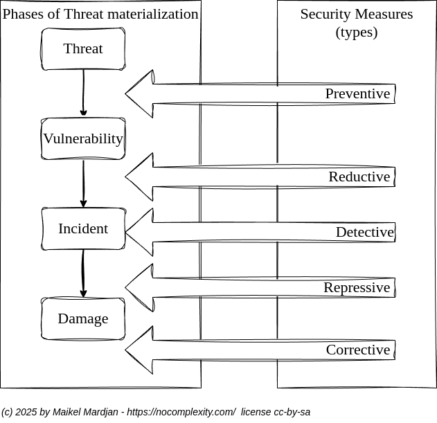

% TAGS [SECURITY-BY-DESIGN] [PREVENTION] [BUSINESS]

# Mitigate cyber risks

## Problem

Mitigating business cyber security risks is not simple, since it involves multiple business aspects and various business stakeholders. 

Understanding cyber security technology details and overviewing derived business risks requires both a deep understanding of IT technology, used IT systems, services and contracts, and business processes. 

Understanding technological aspects is not trivial for non technical people who lack years of education and training. And understanding business key aspects of business processes is a different experience and science than being able to understand technological aspects.

## Solution

Business risk is the likelihood that a threat due to the existence of a matching vulnerability materializes into a security incident causing damage to the information and/or Information Technology (IT) services of an organization.
The significance of the damage depends on the business value of assets affected and the impact of the security incident.

Before starting it is crucial to have a common understanding of the process and some key aspects of IT security. 

1. The absence of cyber threats implies the absence of business risk. However threats are always present. Make even threats that are not obviously explicit.
2. The absence of vulnerabilities could imply the absence of business risk. However within IT technology vulnerabilities are always present in hardware, firmware, software and network technology! 
3. Without having any types of detection measurements implemented it is impossible to know if information is stolen (copied) or compromised (changed). The bare nature of digital storage technology is still that it is not simple to detect if information is copied or changed for information in rest, transit or in processes! 

To make risks assessment simple: 
* Security measures should focus on the mitigation of vulnerabilities and
* Mitigation of threats

The most significant business risks are imposed by services having high business value and
those that are exposed to significant risks. A simple way to have a good discussion of needed and useless security measurements is to put different cost factors for the common types of security measures in a table. 

