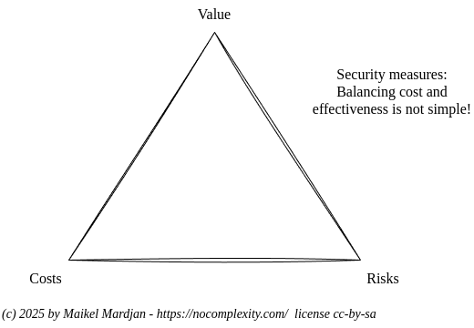
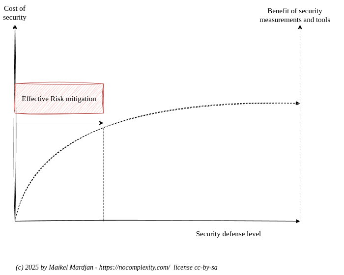
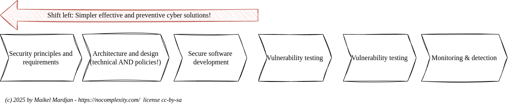
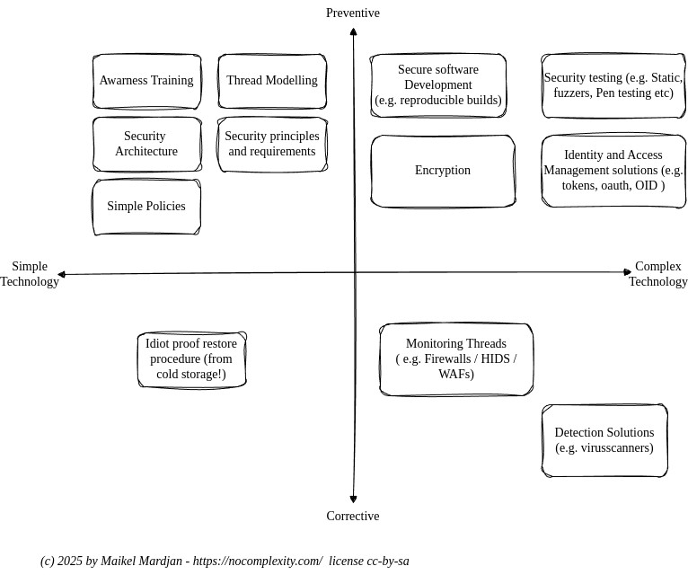

# Shift left

Cyber security is complex. Hover cyber solutions that are effective do not need to be complex and very expensive. 

To avoid misunderstandings: Simplifying your security landscape is not simple at all! It means rethinking your strategy and reprioritize the objectives:
* Risks
* Costs
* Value

It is crucial to remember that risks can never be zero. The perfect security solution with zero risks does not exist. There will always be risks that can not be mitigated. Not by technology nor by procedures. And costs are always limited. Security is not a feature, but a costly quality attribute that is only noticed when things go very wrong. 

More budget and more expensive cyber technology does not help to mitigate all your risks. There is an optimum.

What is needed is a shift to simpler thinking about cyber security defense measurements.

This means more emphasis on what works from a preventive perspective. Preventive security measurements are often far less technical. But involve humans, human behaviour, human trust and simple to follow procedures and policies that everyone understands and can be followed without friction.

Effective security measures that cost less to design, implement and maintain are preventive solutions. The most simple cost effective preventive cyber solutions have nothing to do with technology. These solutions require changes in business processes or behaviour. E.g. Instead of implementing a very expensive and hard to maintain technology that limits access to confidential documents while also having expensive software to detect unauthorised access. Banning people from having a phone is sometimes a simple and cost effective way to prevent information from being copied.

The best preventive solutions like creating a good security architecture require no complex technology nor expensive maintenance. Complex technology used in cyber security is often corrective software, to detect errors in previous design steps. 

